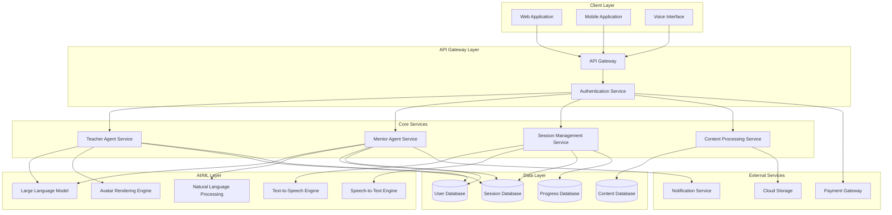

# Design Document: AI-Powered Educational Platform

## Overview

The AI-Powered Educational Platform is a comprehensive educational system that leverages artificial intelligence to provide personalized teaching and mentorship. The platform consists of two primary AI agent types: Teacher Agents that deliver subject-specific instruction using the Socratic method, and Mentor Agents that provide 24/7 personalized learning support, proactive engagement, and study planning.

The system is designed to serve students from children to college level, offering adaptive learning experiences through conversational AI with human-like avatars. The platform differentiates itself through proactive engagement (calling students to remind them to study), real-time class attendance and note-taking, and personalized study routine creation.

## Architecture

### High-Level Architecture



### System Components

1. **Client Layer**: Web, mobile, and voice interfaces for student interaction
2. **API Gateway**: Centralized entry point with authentication and routing
3. **Core Services**: Business logic for teachers, mentors, sessions, and content
4. **AI/ML Layer**: Machine learning models and engines for intelligent behavior
5. **Data Layer**: Persistent storage for users, content, sessions, and progress
6. **External Services**: Third-party integrations for storage, notifications, and payments

## Components and Interfaces

### 1. Teacher Agent Service

**Responsibilities:**
- Manage Teacher Agent lifecycle (creation, configuration, deletion)
- Process training materials to build agent knowledge base
- Implement Socratic teaching method logic
- Deliver personalized instruction based on student level
- Adapt teaching approach based on student responses

**Key Interfaces:**

```typescript
interface TeacherAgentService {
  createTeacherAgent(config: TeacherAgentConfig): Promise<TeacherAgent>
  uploadTrainingMaterial(agentId: string, material: TrainingMaterial): Promise<void>
  processTrainingMaterial(agentId: string, materialId: string): Promise<void>
  startTeachingSession(agentId: string, studentId: string): Promise<Session>
  respondToStudent(sessionId: string, studentInput: string): Promise<TeacherResponse>
  adaptTeachingStrategy(sessionId: string, comprehensionLevel: number): Promise<void>
}

interface TeacherAgentConfig {
  name: string
  subject: string
  educationLevel: EducationLevel
  avatarStyle: AvatarStyle
  teachingPersonality: TeachingPersonality
}

interface TrainingMaterial {
  type: 'pdf' | 'video' | 'book'
  content: Buffer | string
  metadata: MaterialMetadata
}

interface TeacherResponse {
  message: string
  questions: string[]
  hints: string[]
  nextConcepts: string[]
  comprehensionCheck: boolean
}

enum EducationLevel {
  Children = 'children',
  Primary = 'primary',
  Secondary = 'secondary',
  HighSchool = 'high_school',
  College = 'college'
}
```

### 2. Mentor Agent Service

**Responsibilities:**
- Provide 24/7 mentorship support
- Attend virtual classes and take notes
- Create and update personalized study routines
- Proactively engage students with reminders
- Track student progress across subjects
- Analyze learning patterns

**Key Interfaces:**

```typescript
interface MentorAgentService {
  assignMentorToStudent(studentId: string, subscriptionId: string): Promise<MentorAgent>
  attendClass(mentorId: string, classSession: ClassSession): Promise<ClassNotes>
  processClassNotes(mentorId: string, notesId: string): Promise<ProcessedNotes>
  createStudyRoutine(mentorId: string, studentId: string): Promise<StudyRoutine>
  updateStudyRoutine(routineId: string, progressData: ProgressData): Promise<StudyRoutine>
  sendProactiveReminder(mentorId: string, studentId: string, reminder: Reminder): Promise<void>
  analyzeStudentProgress(mentorId: string, studentId: string): Promise<ProgressAnalysis>
}

interface ClassSession {
  subject: string
  duration: number
  audioVideoStream: Stream
  metadata: ClassMetadata
}

interface ClassNotes {
  id: string
  transcript: string
  keyPoints: string[]
  topics: string[]
  timestamp: Date
}

interface StudyRoutine {
  id: string
  studentId: string
  schedule: StudySession[]
  subjects: Subject[]
  adaptiveAdjustments: Adjustment[]
}

interface StudySession {
  subject: string
  topic: string
  scheduledTime: Date
  duration: number
  priority: Priority
  materials: string[]
}

interface Reminder {
  type: 'voice_call' | 'text_message' | 'push_notification'
  message: string
  scheduledTime: Date
  studySession: StudySession
}
```

### 3. Session Management Service

**Responsibilities:**
- Manage interactive learning sessions
- Handle real-time communication (voice and text)
- Track session state and progress
- Record session history
- Coordinate between students and AI agents

**Key Interfaces:**

```typescript
interface SessionManagementService {
  createSession(studentId: string, agentId: string, type: SessionType): Promise<Session>
  joinSession(sessionId: string, participantId: string): Promise<void>
  sendMessage(sessionId: string, message: Message): Promise<void>
  endSession(sessionId: string): Promise<SessionSummary>
  getSessionHistory(studentId: string, filters: SessionFilters): Promise<Session[]>
  saveSessionProgress(sessionId: string, progress: SessionProgress): Promise<void>
}

interface Session {
  id: string
  studentId: string
  agentId: string
  type: SessionType
  startTime: Date
  endTime?: Date
  messages: Message[]
  progress: SessionProgress
  state: SessionState
}

interface Message {
  senderId: string
  content: string
  type: 'text' | 'voice' | 'video'
  timestamp: Date
  metadata: MessageMetadata
}

interface SessionProgress {
  topicsCovered: string[]
  comprehensionLevel: number
  questionsAsked: number
  questionsAnswered: number
  strugglingConcepts: string[]
  masteredConcepts: string[]
}

enum SessionType {
  Teaching = 'teaching',
  Mentoring = 'mentoring',
  Review = 'review',
  Assessment = 'assessment'
}
```

### 4. Content Processing Service

**Responsibilities:**
- Process uploaded training materials (PDFs, videos, books)
- Extract knowledge from various content formats
- Build searchable knowledge bases for agents
- Manage content storage and retrieval
- Generate embeddings for semantic search

**Key Interfaces:**

```typescript
interface ContentProcessingService {
  uploadContent(content: Content): Promise<string>
  processContent(contentId: string): Promise<ProcessedContent>
  extractKnowledge(contentId: string): Promise<KnowledgeBase>
  searchKnowledge(agentId: string, query: string): Promise<KnowledgeResult[]>
  updateKnowledgeBase(agentId: string, knowledge: KnowledgeBase): Promise<void>
}

interface Content {
  type: ContentType
  data: Buffer | string
  metadata: ContentMetadata
}

interface ProcessedContent {
  id: string
  originalContentId: string
  extractedText: string
  keyTopics: string[]
  concepts: Concept[]
  embeddings: number[][]
}

interface KnowledgeBase {
  agentId: string
  documents: Document[]
  concepts: Concept[]
  relationships: ConceptRelationship[]
  embeddings: EmbeddingIndex
}

interface Concept {
  name: string
  definition: string
  examples: string[]
  prerequisites: string[]
  difficulty: number
}
```

### 5. Avatar Rendering Engine

**Responsibilities:**
- Render human-like avatars
- Animate facial expressions
- Synchronize lip movements with speech
- Customize avatar appearance
- Stream avatar video to clients

**Key Interfaces:**

```typescript
interface AvatarRenderingEngine {
  createAvatar(config: AvatarConfig): Promise<Avatar>
  renderFrame(avatarId: string, expression: Expression, speech: AudioData): Promise<VideoFrame>
  animateAvatar(avatarId: string, animation: Animation): Promise<VideoStream>
  customizeAppearance(avatarId: string, appearance: Appearance): Promise<Avatar>
}

interface AvatarConfig {
  style: AvatarStyle
  gender: Gender
  age: AgeRange
  ethnicity: Ethnicity
  personality: PersonalityTraits
}

interface Expression {
  type: ExpressionType
  intensity: number
  duration: number
}

interface Appearance {
  hairStyle: string
  hairColor: string
  eyeColor: string
  skinTone: string
  clothing: string
}

enum AvatarStyle {
  Realistic = 'realistic',
  Cartoon = 'cartoon',
  Anime = 'anime',
  Professional = 'professional'
}
```

### 6. Subscription Management Service

**Responsibilities:**
- Manage student subscriptions
- Handle payment processing
- Control feature access based on subscription tier
- Send subscription notifications
- Track subscription analytics

**Key Interfaces:**

```typescript
interface SubscriptionManagementService {
  createSubscription(studentId: string, tier: SubscriptionTier): Promise<Subscription>
  updateSubscription(subscriptionId: string, updates: SubscriptionUpdates): Promise<Subscription>
  cancelSubscription(subscriptionId: string): Promise<void>
  checkAccess(studentId: string, feature: Feature): Promise<boolean>
  processPayment(subscriptionId: string, payment: Payment): Promise<PaymentResult>
  sendExpirationNotification(subscriptionId: string): Promise<void>
}

interface Subscription {
  id: string
  studentId: string
  tier: SubscriptionTier
  startDate: Date
  endDate: Date
  status: SubscriptionStatus
  features: Feature[]
  paymentHistory: Payment[]
}

enum SubscriptionTier {
  Free = 'free',
  Basic = 'basic',
  Premium = 'premium',
  Enterprise = 'enterprise'
}

enum Feature {
  TeacherAccess = 'teacher_access',
  MentorAccess = 'mentor_access',
  ProactiveReminders = 'proactive_reminders',
  ClassNotes = 'class_notes',
  StudyRoutines = 'study_routines',
  ProgressTracking = 'progress_tracking'
}
```

## Data Models

### User Models

```typescript
interface Student {
  id: string
  name: string
  email: string
  age: number
  educationLevel: EducationLevel
  subscriptionId?: string
  mentorId?: string
  learningProfile: LearningProfile
  progressData: ProgressData
  createdAt: Date
  updatedAt: Date
}

interface LearningProfile {
  studentId: string
  preferredLearningStyle: LearningStyle
  strengths: string[]
  weaknesses: string[]
  interests: string[]
  goals: string[]
  availableStudyTime: TimeSlot[]
}

enum LearningStyle {
  Visual = 'visual',
  Auditory = 'auditory',
  Kinesthetic = 'kinesthetic',
  ReadingWriting = 'reading_writing'
}
```

### Agent Models

```typescript
interface TeacherAgent {
  id: string
  name: string
  subject: string
  educationLevel: EducationLevel
  knowledgeBaseId: string
  avatarId: string
  teachingStyle: TeachingStyle
  trainingMaterials: string[]
  createdAt: Date
  updatedAt: Date
}

interface MentorAgent {
  id: string
  studentId: string
  avatarId: string
  knowledgeBaseId: string
  studyRoutineId?: string
  classNotes: string[]
  reminderSettings: ReminderSettings
  createdAt: Date
  updatedAt: Date
}

interface ReminderSettings {
  enabled: boolean
  frequency: ReminderFrequency
  preferredTimes: Date[]
  methods: ReminderMethod[]
}

enum ReminderFrequency {
  Daily = 'daily',
  EveryOtherDay = 'every_other_day',
  Weekly = 'weekly',
  Custom = 'custom'
}

enum ReminderMethod {
  VoiceCall = 'voice_call',
  TextMessage = 'text_message',
  PushNotification = 'push_notification',
  Email = 'email'
}
```

### Progress Models

```typescript
interface ProgressData {
  studentId: string
  subjects: SubjectProgress[]
  overallComprehension: number
  studyStreak: number
  totalStudyTime: number
  achievements: Achievement[]
  lastUpdated: Date
}

interface SubjectProgress {
  subject: string
  topics: TopicProgress[]
  comprehensionLevel: number
  timeSpent: number
  sessionsCompleted: number
}

interface TopicProgress {
  topic: string
  status: TopicStatus
  comprehensionLevel: number
  attempts: number
  lastReviewed: Date
  masteryDate?: Date
}

enum TopicStatus {
  NotStarted = 'not_started',
  InProgress = 'in_progress',
  Struggling = 'struggling',
  Completed = 'completed',
  Mastered = 'mastered'
}

interface Achievement {
  id: string
  title: string
  description: string
  earnedDate: Date
  category: AchievementCategory
}
```

## Correctness Properties

*A property is a characteristic or behavior that should hold true across all valid executions of a system—essentially, a formal statement about what the system should do. Properties serve as the bridge between human-readable specifications and machine-verifiable correctness guarantees.*

